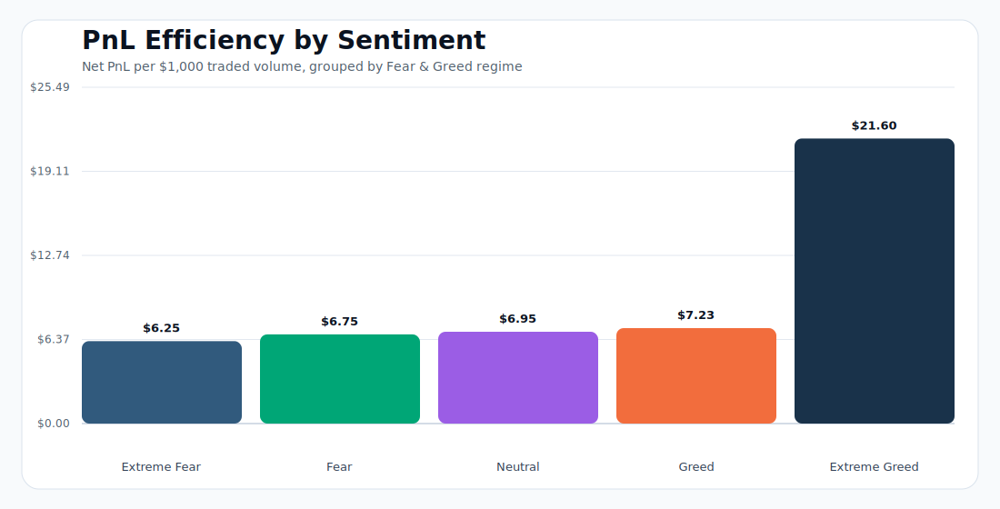
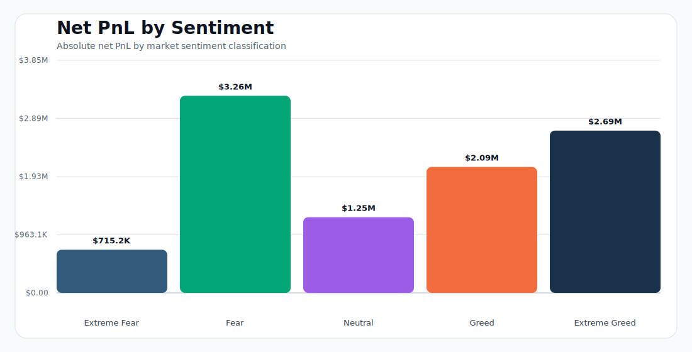
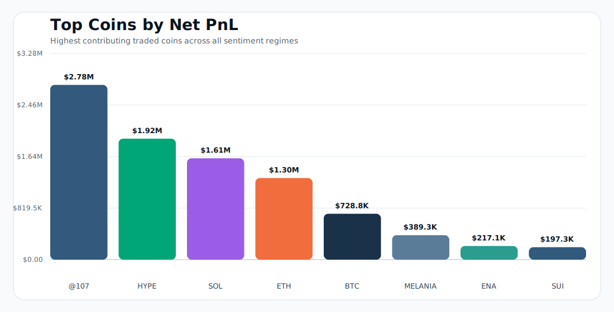

                                                                 # Trader Sentiment Analysis

<p align="center">
  <b>Hyperliquid trader performance mapped against Bitcoin Fear & Greed market regimes</b>
</p>

<p align="center">
  <a href="outputs/trader_sentiment_analysis/trader_sentiment_analysis.xlsx"></a>
  <a href="outputs/trader_sentiment_analysis/trader_sentiment_report.md"></a>
  
  
</p>

---

## Judge Start Here

| Priority | File | Why it matters |
|---:|---|---|
| 1 | [Final Excel Workbook](outputs/trader_sentiment_analysis/trader_sentiment_analysis.xlsx) | Main submission output: executive dashboard, charts, sentiment/regime summaries, account edges, and notes. |
| 2 | [Written Analysis Report](outputs/trader_sentiment_analysis/trader_sentiment_report.md) | Short narrative summary of methodology, findings, and strategy implications. |
| 3 | [Statistical Validation](outputs/trader_sentiment_analysis/statistical_validation.csv) | Bootstrap confidence intervals that test whether regime efficiency is stable across days. |
| 4 | [Data Dictionary](DATA_DICTIONARY.md) | Plain-English explanation of raw columns, derived metrics, and output files. |
| 5 | [Analysis Script](analysis/trader_sentiment_analysis.py) | Reproducible Python pipeline that joins the datasets and regenerates the analytical CSV/report outputs. |

The primary output file is:

```text
outputs/trader_sentiment_analysis/trader_sentiment_analysis.xlsx
```

## Executive Dashboard Preview

The Excel workbook opens with a polished executive dashboard designed for quick review.


## Visual Findings

These charts are generated from the analysis outputs so judges can review the core story without opening Excel first.

### PnL Efficiency by Sentiment



### Net PnL by Sentiment



### Top Coins by Net PnL



## Assignment Objective

Explore the relationship between trader performance and Bitcoin market sentiment, uncover hidden patterns, and deliver insights that can support smarter trading strategies.

## What Was Analyzed

| Dataset | Role in analysis |
|---|---|
| Bitcoin Fear & Greed Index | Daily market sentiment regime: Extreme Fear, Fear, Neutral, Greed, Extreme Greed. |
| Hyperliquid historical trader data | Trade-level account, coin, side, size, fees, timestamps, direction, and closed PnL. |

## Headline Findings

| Question | Answer |
|---|---|
| Best efficiency regime | Extreme Greed, about `$21.60` net PnL per `$1,000` traded. |
| Highest total net PnL regime | Fear, about `$3.26M` net PnL. |
| Sentiment as signal | Weak daily correlation with PnL, so sentiment works better as a regime filter than as a standalone signal. |
| Strategy implication | Use sentiment to adjust playbooks, position sizing, and account/trader selection. |

## Strategy Recommendations

| Recommendation | What it means |
|---|---|
| Regime-aware sizing | Increase size only where both absolute PnL and PnL efficiency are strong. Extreme Greed had the best efficiency, while Fear had the highest total PnL. |
| Playbook selection | Do not use the same long/short playbook across all regimes. Direction-level results show certain close/sell behaviors worked better in specific sentiment buckets. |
| Trader selection | Use `greed_minus_fear_efficiency` to identify accounts that perform better in momentum regimes versus fear regimes. |
| Risk controls | If a sentiment bucket's bootstrap interval crosses zero, cap exposure or require confirmation from BTC trend, volatility, funding, or liquidation data. |
| Production upgrade | Combine sentiment with BTC returns, funding rates, open interest, realized volatility, and liquidation intensity before using it live. |

## Statistical Validation

Daily regime metrics were bootstrapped to estimate 95% confidence intervals for average daily PnL efficiency.

| Sentiment | Validation takeaway |
|---|---|
| Fear | Daily efficiency stayed positive in the bootstrap interval. |
| Greed | Daily efficiency stayed positive in the bootstrap interval. |
| Extreme Greed | Strongest and most stable efficiency interval among the sentiment buckets. |
| Extreme Fear | Interval crossed zero, so the edge is less stable and should be risk-capped. |
| Neutral | Interval crossed zero, so it should not be treated as a strong standalone edge. |

Full validation table: [statistical_validation.csv](outputs/trader_sentiment_analysis/statistical_validation.csv)

## Methodology

1. Parsed Hyperliquid `Timestamp IST` into a trade date.
2. Joined every trade to the Fear & Greed Index using trade date.
3. Treated rows with nonzero `Closed PnL` as realized trades for win-rate analysis.
4. Calculated `net_pnl = Closed PnL - Fee`.
5. Compared performance across sentiment regimes using trade count, realized trades, volume, net PnL, win rate, and PnL per `$1,000` traded volume.
6. Built account-level, coin-level, direction-level, and daily trend summaries.

## Repository Structure

```text
.
|-- analysis/
|   `-- trader_sentiment_analysis.py
|-- data/
|   |-- fear_greed_index.csv
|   `-- historical_data.csv
|-- outputs/
|   `-- trader_sentiment_analysis/
|       |-- trader_sentiment_analysis.xlsx
|       |-- trader_sentiment_report.md
|       |-- dashboard_preview.png
|       |-- statistical_validation.csv
|       |-- charts/
|       `-- summary CSV files
|-- DATA_DICTIONARY.md
|-- README.md
`-- requirements.txt
```

## Reproduce the Analysis

```bash
pip install -r requirements.txt
python analysis/trader_sentiment_analysis.py
```

The script reads from `data/` and writes refreshed analytical outputs under:

```text
outputs/trader_sentiment_analysis/
```

## Deliverables Checklist

| Requirement | Status |
|---|---|
| Raw datasets included | Complete |
| Reproducible analysis script | Complete |
| Sentiment/trade join | Complete |
| Trader performance metrics | Complete |
| Hidden-pattern summaries | Complete |
| Statistical validation | Complete |
| Data dictionary | Complete |
| README chart visuals | Complete |
| Final Excel workbook | Complete |
| Written report | Complete |

---

