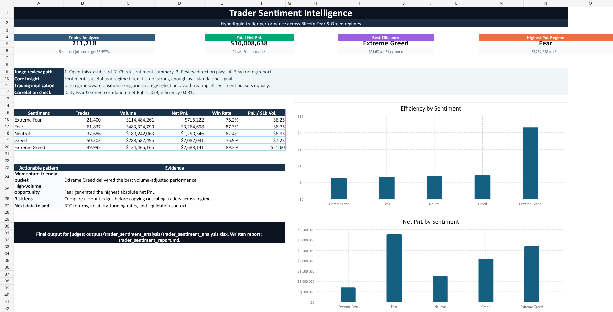

# Trader Sentiment Analysis

<p align="center">
  <b>Hyperliquid trader performance mapped against Bitcoin Fear & Greed market regimes</b>
</p>

<p align="center">
  <a href="outputs/trader_sentiment_analysis/trader_sentiment_analysis.xlsx"></a>
  <a href="outputs/trader_sentiment_analysis/trader_sentiment_report.md"></a>
  
  
</p>

---

## Judge Start Here

| Priority | File | Why it matters |
|---:|---|---|
| 1 | [Final Excel Workbook](outputs/trader_sentiment_analysis/trader_sentiment_analysis.xlsx) | Main submission output: executive dashboard, charts, sentiment/regime summaries, account edges, and notes. |
| 2 | [Written Analysis Report](outputs/trader_sentiment_analysis/trader_sentiment_report.md) | Short narrative summary of methodology, findings, and strategy implications. |
| 3 | [Analysis Script](analysis/trader_sentiment_analysis.py) | Reproducible Python pipeline that joins the datasets and regenerates the analytical CSV/report outputs. |

The primary output file is:

```text
outputs/trader_sentiment_analysis/trader_sentiment_analysis.xlsx
```

## Executive Dashboard Preview

The Excel workbook opens with a polished executive dashboard designed for quick review.



## Assignment Objective

Explore the relationship between trader performance and Bitcoin market sentiment, uncover hidden patterns, and deliver insights that can support smarter trading strategies.

## What Was Analyzed

| Dataset | Role in analysis |
|---|---|
| Bitcoin Fear & Greed Index | Daily market sentiment regime: Extreme Fear, Fear, Neutral, Greed, Extreme Greed. |
| Hyperliquid historical trader data | Trade-level account, coin, side, size, fees, timestamps, direction, and closed PnL. |

## Headline Findings

| Question | Answer |
|---|---|
| Best efficiency regime | Extreme Greed, about `$21.60` net PnL per `$1,000` traded. |
| Highest total net PnL regime | Fear, about `$3.26M` net PnL. |
| Sentiment as signal | Weak daily correlation with PnL, so sentiment works better as a regime filter than as a standalone signal. |
| Strategy implication | Use sentiment to adjust playbooks, position sizing, and account/trader selection. |

## Methodology

1. Parsed Hyperliquid `Timestamp IST` into a trade date.
2. Joined every trade to the Fear & Greed Index using trade date.
3. Treated rows with nonzero `Closed PnL` as realized trades for win-rate analysis.
4. Calculated `net_pnl = Closed PnL - Fee`.
5. Compared performance across sentiment regimes using trade count, realized trades, volume, net PnL, win rate, and PnL per `$1,000` traded volume.
6. Built account-level, coin-level, direction-level, and daily trend summaries.

## Repository Structure

```text
.
|-- analysis/
|   `-- trader_sentiment_analysis.py
|-- data/
|   |-- fear_greed_index.csv
|   `-- historical_data.csv
|-- outputs/
|   `-- trader_sentiment_analysis/
|       |-- trader_sentiment_analysis.xlsx
|       |-- trader_sentiment_report.md
|       |-- dashboard_preview.png
|       `-- summary CSV files
|-- README.md
`-- requirements.txt
```

## Reproduce the Analysis

```bash
pip install -r requirements.txt
python analysis/trader_sentiment_analysis.py
```

The script reads from `data/` and writes refreshed analytical outputs under:

```text
outputs/trader_sentiment_analysis/
```

## Deliverables Checklist

| Requirement | Status |
|---|---|
| Raw datasets included | Complete |
| Reproducible analysis script | Complete |
| Sentiment/trade join | Complete |
| Trader performance metrics | Complete |
| Hidden-pattern summaries | Complete |
| Final Excel workbook | Complete |
| Written report | Complete |

---

<p align="center">
  <b>Final submission link:</b>
  <a href="https://github.com/Sujaicodes/Trader-sentiment-Analysis">github.com/Sujaicodes/Trader-sentiment-Analysis</a>
</p>
